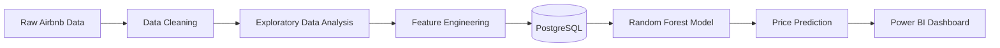
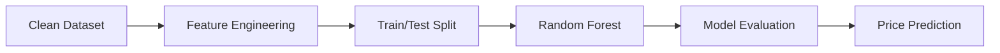

<h1 align="center">🏠 Airbnb Market Intelligence</h1>

<p align="center">


</p>

<p align="center">


</p>

---

## 📌 Project Overview

An end-to-end **Data Analytics**, **Machine Learning**, and **Business Intelligence** project that analyzes Airbnb listings across multiple cities to uncover pricing trends, host performance, and customer review insights.

---

## 🎯 Objectives

- Analyze Airbnb market trends
- Identify factors affecting listing prices
- Compare pricing across cities
- Study host performance
- Analyze customer reviews
- Build a Machine Learning model for price prediction
- Create an interactive Power BI dashboard

---

## 🚀 End-to-End Pipeline

> **Raw Airbnb Data → Data Cleaning → Exploratory Data Analysis → Feature Engineering → PostgreSQL → Machine Learning → Power BI Dashboard**

---

## 🏗️ Project Workflow



---

## ✨ Key Features

| Feature | Description |
|---------|-------------|
| 📊 Interactive Dashboard | Executive & Pricing Analytics |
| 🤖 Machine Learning | Random Forest Price Prediction |
| 🧹 ETL Pipeline | Data Cleaning & Preprocessing |
| 📈 Exploratory Data Analysis | Market & Pricing Insights |
| ⚙️ Feature Engineering | Domain-Specific Features |
| 🗄️ PostgreSQL | Data Storage & SQL Analysis |

---

## 🛠️ Tech Stack

<p align="center">


</p>

<p align="center">

<b>Power BI</b> • <b>Pandas</b> • <b>NumPy</b> • <b>Scikit-learn</b> • <b>Matplotlib</b> • <b>Seaborn</b>

</p>

---

## 📂 Repository Structure

```text
Airbnb-Market-Intelligence/
│
├── dashboard/
├── data/
├── database/
├── images/
├── models/
├── notebooks/
├── reports/
├── scripts/
├── sql/
├── requirements.txt
└── README.md
```

---

## 📊 Dashboard

The interactive Power BI dashboard enables exploration of Airbnb pricing trends, host performance, room type distribution, and customer review insights.

| Executive Dashboard | Pricing Analysis |
|---------------------|------------------|
| Total Listings | Average Price |
| Total Hosts | Median Price |
| Total Reviews | Property Type Analysis |
| Average Review Score | Room Type Analysis |
| Top Cities | Price Distribution |
| Room Distribution | Review Score Analysis |

---

## 📸 Dashboard Preview

<p align="center">

</p>

---

## 🤖 Machine Learning

| Attribute | Details |
|-----------|---------|
| **Model** | Random Forest Regressor |
| **Target Variable** | Airbnb Listing Price |
| **Evaluation** | Regression Performance Metrics |
| **Output** | Trained `.pkl` Model |

### ML Pipeline



---

## 📈 Feature Engineering

Engineered domain-specific features to improve model performance.

- Host Experience
- Amenities Count
- Bedroom Density
- Price Per Guest
- Overall Review Score
- Host Quality
- Estimated Monthly Revenue
- Price Category
- Rating Category

---

## ⚡ Quick Start

```bash
git clone https://github.com/Souptik-Hazra/Airbnb-Market-Intelligence.git

cd Airbnb-Market-Intelligence

pip install -r requirements.txt

jupyter notebook
```

---

## 💡 Business Insights

- 📍 Compare Airbnb prices across cities
- 🏠 Analyze room and property types
- ⭐ Measure review score impact on pricing
- 👤 Evaluate host performance
- 💰 Predict listing prices using Machine Learning

---

## 🚀 Future Enhancements

- Streamlit Web Application
- Real-Time Price Prediction
- Recommendation System
- Time-Series Forecasting
- Cloud Deployment

---

<div align="center">

### ⭐ Built with Python • PostgreSQL • Machine Learning • Power BI


</div>
